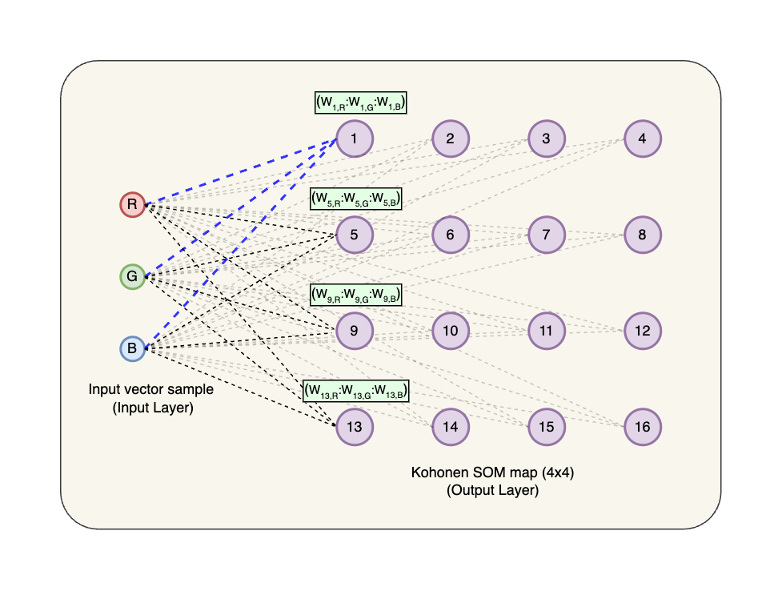

# Kohonen Self-Organising Maps (SOM) with FastAPI and AWS Lambda Container Images

This is a Python implementation of [Kohonen Self-Organising Maps (SOM)](https://en.wikipedia.org/wiki/Self-organizing_map), a type of unsupervised learning algorithm. Kohonen Maps are typically used for clustering and visualising so that higher-dimensional data can be represented in lower dimensions, typically in 2D like in a rectangular topology or grid.

In addition to segmentation and clustering analysis, it is also a form of dimensionality reduction technique so that the high-dimensional data in the input layer can be represented in the output grid. 


What's great about studying Kohonen Maps is that they are relatively simple algorithms, and can seem like magic when they are able to cluster and segment the input data. In this project, we are presenting the Kohonen SOM with input data in the form or RGB colours, and it will try to segment and cluster the colours in a 2D grid.

Because our input data is made up of 3 components (features), the nodes in the output layer are also made up of the same RGB components making them easy and fun to visualise. 

A description for training a Kohonen SOM algorithm is [detailed here](./kohonen.ipynb).

## Kohonen Input and Output Layer

A Kohonen SOM has two layers, the **input layer** and the **output layer**. The input layer is made up of the features of the data, while the output layer is made up of the nodes that will be trained to represent the input data. In this project, our input layer is made up of floats (which represent RGB colours), and the output layer is a 2D grid of nodes, each node also made up of RGB components.

The image below shows a very simple SOM with an input layer of 3 features and an output layer of 16 nodes. In this project, we only have 3 features (RGB colour components), however, you can have more features in the input layer. For example, if you are trying to segment customers, the features can be income, sex, age, race, etc.

With our input features (and output node weights) conveniently RGB components, we can easily visualise the output layer as a 2D grid of colours.



If you look at each node in the output layer, you will notice that there are 3 lines into each node. These lines represent the weight of each feature in the input layer. Each output node weight is also a 3-dimension vector, the same shape as the input layer, and also represent RGB dimension. When updating the node weights during training, the changes to the weight are easily visualised as colours.

## Applications and Use Cases

A more popular clustering and segmentation algorithm is the [K-Means algorithm](https://www.analyticsvidhya.com/blog/2019/08/comprehensive-guide-k-means-clustering/), which is also a type of unsupervised learning algorithm. So applications and use cases for K-Means can also be applied to Kohonen SOM, such as:

### Customer Segmentation


Given the features of  customers, for example age, income, and race, we can segment them into different groups, and then target them with different marketing strategies.

### Image Compression

Although it maybe computationally expensive, a Kohonen SOM can be used to compress images, by reducing the dimensions of the image, while still retaining its important features.

### Recommender Systems


An online shopping platform can utilise users preferences to group them into different clusters and then recommend products based on the preferences of other users in the same cluster.

### Installation

A requirements file declare all dependencies (Mangum, FastAPI, Uvicorn, ...). Use the following command to install the required dependencies:

```
pip install -r ./requirements.txt
```

>#### Virtual Environment
>
>It is best practice to use a virtual environment when working with Python. [pyenv](https://github.com/pyenv/pyenv) was used to manage the Python version, while [venv](https://docs.python.org/3/library/venv.html) was used to create the virtual environment. The following commands were used to create the virtual environment and install the required dependencies:
>```bash
>pyenv install 3.11.1
>pyenv local 3.11.1
>python -m venv kohonen-som-env
>source kohonen-som-env/bin/activate
>```
>The following dependencies were installed using pip:
>```bash
>pip install fastapi
>pip install "uvicorn[standard]"
>pip install numpy
>pip install matplotlib
>pip install mangum
>```
>Then finally, the requirements.txt file was created using the following >command:
>```bash
>pip freeze > requirements.txt
>```
>

## Running locally

This API can be run locally using the following command:

`uvicorn app.app:app --reload --host 0.0.0.0 --port 5000`

You can then try out the API at the following URL:
[http://0.0.0.0:5000/docs](http://0.0.0.0:5000/docs)

## Running on Docker

There are 2 Dockerfiles included in this project: 
- [Dockerfile](./Dockerfile) for running the API on any environment that runs Docker containers. (e.g. AWS Fargate, Azure Container Instances, Google Cloud Run, etc.)

- [Dockerfile.aws.lambda](./Dockerfile.aws.lambda) for running the API on AWS Lambda Container Images.

### Default Dockerfile

- First we need to build the docker image

`docker build -t kohonen-som .`

- Then we can run the container locally like so:

`docker run -p 5000:5000 kohonen-som:latest`

- You can then try out the API by visiting the following URL:
[http://0.0.0.0:5000/docs](http://0.0.0.0:5000/docs)

- [FastAPI](https://fastapi.tiangolo.com/) will provide a Swagger/OpenAPI documentation for the API, which is very useful for testing and debugging, so you won't even need a client like Postman to test the API anymore.

- this default Docker image is built to run on any environment that runs Docker containers, such as AWS Fargate, Azure Container Instances, Google Cloud Run, etc.

### Dockerfile for AWS Lambda Container Images

- First we need to build the docker image, note that this Dockerfile uses a Lambda specific base image.

`docker build -t kohonen-som-lambda . -f Dockerfile.aws.lambda`

- then we can run the container locally like so:

`docker run -p 8000:8080 kohonen-som-lambda:latest`

- unlike the previous Dockerfile, there is more to do to talk to it. We can use the following command to test the API locally. Don't even talk to me about that ugly URL, but its something that we just cannot change. 

```bash
curl -XPOST "http://localhost:8000/2015-03-31/functions/function/invocations" -d '{"resource": "/", "path": "/", "httpMethod": "GET", "requestContext": {}, "multiValueQueryStringParameters": null}'
```

And it should reply with something like this:

```json
{"statusCode": 200, "headers": {"content-disposition": "inline; filename=\"kohonen_som_input_output.png\"", "content-length": "30703", "content-type": "image/png"}, "multiValueHeaders": {}, "body": "iVBORw0KGgoAAAANSUhEUgAAAZAAAAGkCAIAAACQNuQgAAB3tklEQVR4nO29va71s...., "isBase64Encoded": true}
```

### Productionising this API

Hurrah, we now have a docker image that we can install to AWS Lambda. Note that there is still more work to do complete this, such as setting up the API Gateway, but that is beyond the scope of this project.

My deployment preference is serverless first, so I would use AWS Lambda Container Images to deploy it. As with many APIs for data and machine learning applications, the required dependencies will surely be over the 250MB uncompressed limit even when using multiple [Lambda Layers](https://docs.aws.amazon.com/lambda/latest/dg/gettingstarted-concepts.html#gettingstarted-concepts-layer). All the popular Python libraries are quite chunky and will easily go over this Lambda hard limit. Numpy alone is already over 100MB, and we still have FastAPI, Uvicorn, and Mangum to add.

With [Lambda Container Images](https://docs.aws.amazon.com/lambda/latest/dg/images-create.html), this will allow us up to 10GB  container size limit for our API.

To Deploy our Lambda API to AWS, we have a few options, from Click-Ops, AWS [Serverless Application Model (SAM)](https://aws.amazon.com/serverless/sam/), or even Amplify, among others. For this type of project, I will probably use SAM, as it is simple and easy enough to integrate with [Github Actions](https://github.com/features/actions), should we want to add CI automation later on.

## Swagger/OpenAPI documentation
- http://0.0.0.0:5000/docs

This is the image of the swagger documentation:


## Running on Jupyter
I have prepared a Jupyter notebook to demonstrate the Kohonen Self-Organising Maps (SOM) algorithm. The notebook is available in the following link:
[Jupyter Notebook](kohonen.ipynb)

**Vectorised implementation using numpy**
In my first attempt at implementing the Kohonen SOM algorithm, I used the typical Python nested loops following the algorithm [described here](./kohonen.ipynb) to the letter. However, I quickly realised that increasing the iterations to 200, 500, 1000 or more would slow it to a crawl, not very exciting when deploying it to production.

The algorithm could be vectorised using numpy, which would make it more efficient, and faster. I have implemented both versions and compared the execution times, as shown below. The vectorised implementation is around **76x** faster than the non-vectorised version.

- Input layer: 20 colours
- Output layer: 100x100 grid
- Iterations: 1000
- Execution time (hh:mm:ss.ms): 00:00:09.294 (around 9 seconds)


**Non-vectorised implementation using nested loops**
- Input layer: 20 colours
- Output layer: 100x100 grid
- Iterations: 1000
- Execution time (hh:mm:ss.ms): 00:10:08.91 (over ten minutes!)

